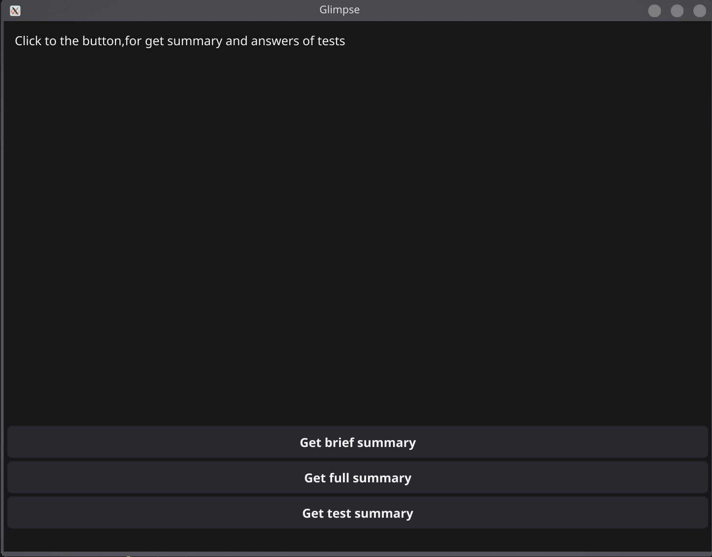

 

# 📋 Glimpse
___
**Glimpse** — лёгкий desktop-инструмент на Go с графическим интерфейсом.
Делает снимок экрана по нажатию кнопки, отправляет его в Gemini AI и возвращает
результат прямо в окне — краткую сводку, подробный анализ или ответы на тест.


___

## 🛠 Стек

- **Go** — основной язык
- **Fyne v2** — GUI фреймворк
- **Gemini 1.5 Flash** — AI API
- **Spectacle** — захват экрана (Linux)

___

## 📁 Структура проекта

```
glimpse/
├── cmd/
│   └── main.go          # Точка входа
├── internal/
│   ├── actions/         # Промпты для ИИ
│   ├── api/             # Обращение к Gemini
│   ├── capture/         # Захват экрана
│   └── overlay/         # GUI окно
├── .env                 # API ключ
└── go.mod
```

___

## ✅ Установка и запуск

Клонировать репозиторий

```bash
git clone https://github.com/orionvega2343-cloud/glimpse.git
```

Подтянуть все зависимости

```bash
go mod tidy
```

Компиляция и быстрый запуск

```bash
go run ./cmd/main.go
```

Или скомпилировать бинарник

```bash
go build .
```

Запуск

```bash
./main
```

___

## 🔑 API

Чтобы подключить ответы ИИ к проекту, вам нужно получить API ключ

1. Заходим на сайт [перейти](https://aistudio.google.com)
2. Нажимаем **GET API KEY**
3. Генерируем и копируем ключ
4. Создаём файл `.env` и добавляем переменную:

```
API_KEY=ваш_ключ
```

5. Запускаем

___

## ⚙️ Работа программы

Программа выполняет 3 действия:

`Get brief summary` — делает скриншот экрана пользователя, и обращается к ИИ для получения **краткой** сводки

`Get full summary` — делает скриншот экрана пользователя, и обращается к ИИ для получения **полной** сводки

`Get test summary` — делает скриншот экрана пользователя, и обращается к ИИ для получения ответа на **тест** на экране пользователя
